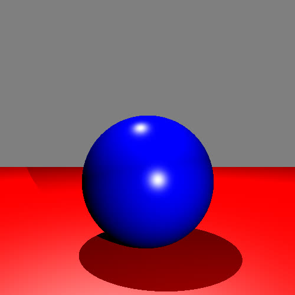
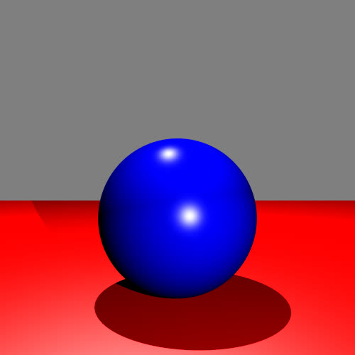
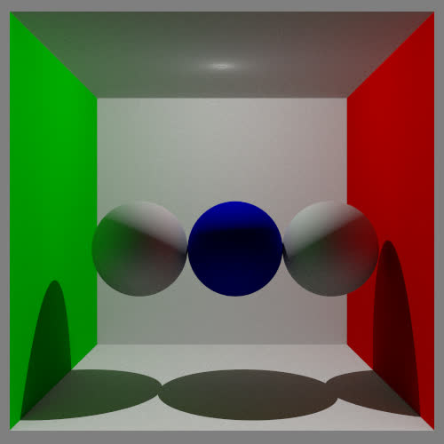

This code is based on course project from Concordia University [COMP371](https://users.encs.concordia.ca/~graphics/teaching/computer-graphics/).

The following files are provided by the course instructor:

1. Showcased in `assets` folder (except for `cornell_box_demo`)
2. Libraries and tests in `external` folder
3. The `main.cpp` and `CMakeLists.txt`

Those files (except for CMakeLists.txt`) remain unchanged for evaluation purposes.

Please modify the cmake file for you to build on your machine.

## Showcase

Direct Illumination



Anti-aliasing



Global Illumination (Path-tracing)



**The original readme content is attached below:**

```txt
This code is used for three purposes:

1) Build the official course solution
2) Build the student solution 
3) Build a dummy application that showcases some of the codebase.

Each build is controlled by two defines:
COURSE_SOLUTION and STUDENT_SOLUTION.

If none of these variables are defined the dummy code is built. This is the default behaviour.
If COURSE_SOLUTION is defined, the code expects the course solution (this should never be defined)
IF STUDENT_SOLUTION is defined the code expects a student solution is implemented in the src folder. Have a look at the main.cpp file for the expected interface.

You can switch on and off these defines in the CMakeLists.txt file. 


Building the dummy test

1) Create build folder: mkdir build
2) cd build
3) cmake ../
4) make
5) ./raytracer

Building the solution:
1) Uncomment the #add_compile_options(-DSTUDENT_SOLUTION) line in the CMakeLists.txt 
2) Create build folder: mkdir build
3) Create the src folder: mkdir src
3) cd build
3) cmake ../
4) make
5) ./raytracer <filename.json>


Note that some test scenes are provided in the assets folder. You can do a soft link to the assets folder in the build folder for your convenience.
```
